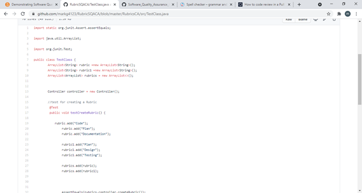

# Test Driven Development

  

When creating tests for the software in this assignment, I created a test for each commit I made. Essentially, I had a test for each User Story.

Unit testing makes sure that all code meets quality standards. Over the course of the product development life cycle, unit testing saves time and money, and helps developers write better code, more efficiently.

  

  Above is an example of one of the test I created to test the creation of a Rubric. A Rubric is a list of Criteria. I created this when I wrote the code to create a Rubric. 