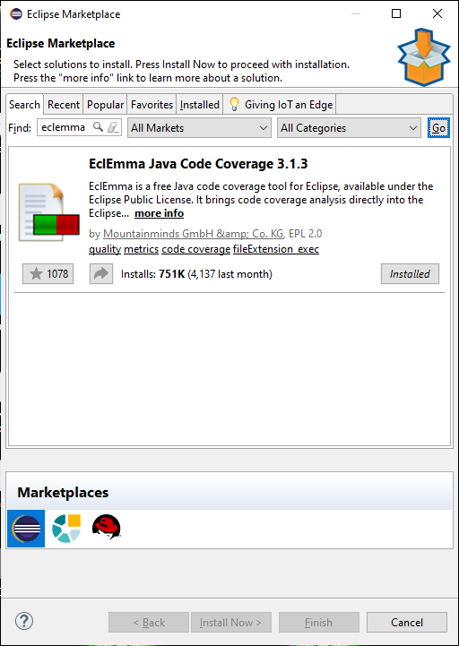
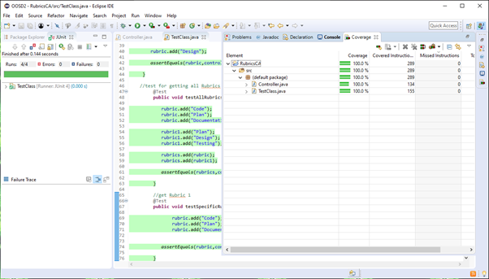

# 
 **Demonstrating Software Quality** 

## 
  Author: Mark Grogan - C17399611 

  

---
## Scrum Sprint Backlog 
---
 

| Story                                         | Estimation  | Priority |
| :---                                          |    :----:   |  :----:  |
|Create a new Rubric                            | 1           |  1       |
|Add a Criterion to a Rubric                    | 3           |  2       |
|Get a list of all Rubrics                      | 2           |  3       |
|Get a specific Rubric by name                  | 4           |  4       |
|Create a new StudentGrade                      | 2           |  5       |
|Add score for criterion to a grade             | 3           |  6       |
|Get all StudentGrades associated with a Rubric | 4           |  7       |
|Calculate Average                              | 2           |  8       |
|Calculate Standard Deviation                   | 4           |  9       |
|Define Min and Max Score                       | 2           |  10      |
|Generate Summary                               | 2           |  11      |
|Total                                          | 29                     |

 

---
##  Task Estimation
---

##  Three-point Estimation

  

 
I used three-point estimate as I found that it is the most effective way to estimate tasks in scrum when doing so alone. With three-point estimate, I have three values, 1. The most likely value, 2. The optimistic value and 3. The pessimistic value.To calculate the actual estimate, I add the three values defined above and simply divide by 3. This gives me the most accurate task estimation value.
 

 
As seen in the Sprint Backlog above, Creating a new Rubric is given a estimation value of 1. Creating a new Rubric is relatively basic and will not require a lot of time to code. Alternatively, calculating the standard deviation is more of a complicated process and will take more time to code. Therefore it is given an estimation value of 4.
 

##  Velocity Metric

The Velocity Metric is calculated by adding up all the estimations for all fully completed tasks at the end of the Sprint. Knowing the velocity of a sprint allows me to know how many sprints it will take to achieve a desired level of functionality.
 
 

---
## Team Version Control
---

  

## Branches

- main
- develop
- sprint_backlog
- task_estimation
- team_version_control
- test_coverage
- test_driven_development
- code_review

 
Above is a list of the branches I created for this project. Spintbacklog_taskestimation contains a backlog of tasks and estimations of how long they will take to complete. Team_version_control contains a description of the branches used and how they fit in GitFlow. Test_coverage defines the test coverage tool I used and how I used it. Test_driven_development describes the commits made to my repository. Code_review contains a checklist of things that I should check when reviewing a Pull Request.
 

 
 The following branches: sprintbacklog_taskestimation, team_version_control, test_coverage, test_driven_development, code_review are merged into the develop branch. After review, the develop branch will finally be merged to the main branch as one README.md file.
 

# Test Coverage

  

 
When writing unit tests, using a test coverage tool is very important. A test coverage tool will monitor the execution of your test suite and tell you how many of the statements, branches, functions and lines were run as part of your tests. This highlights the parts of your software you may not have tested.
 

---
## EclEmma
---
For this assignment the coverage tool I used was EclEmma. EclEmma is a java code coverage tool for Eclipse, available from the Eclipse marketplace. 

  

EclEmma is simple to set up and does not require any modifications to your project. Once downloaded the tool runs from eclipse. From the menu inside the IDE click Run and from the drop down menu and choose Coverage. The tool will then analyse your code and return information on what has been tested and what has not been tested. The results are immediately summarized and highlighted in your source code editors. See example below.

  

 
 EclEmma brings the code coverage analysis directly into your Eclipse workbench. It is straight forward to use and is accurate and effective.
 
