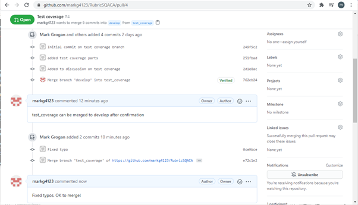

# Code Review Checklist 

---
## What is a Code review?
---

Code review, also known as Peer Code Review, is a systematic examination of software code. The intention is to find bugs and improve software quality. Code review allows team members maintain a consistency between design and implementation techniques.

---
## Why do a Code review?
---

- Consistent design and implementation.
- Minimizing mistakes and their impact.
- Ensuring project quality and meeting requirements.

---
## Pull Requests
---

  

In this assignment, I am working individually and accept my own pull requests. After a pull request is created, I will approve it, if there is no more work to be done on it by commenting my approval on the request. The branches can then be merged.

  

---
## Code Review Checklist for Pull Requests
---

- Check for bad practices in the code.
- Analyse the impact of the changes being made.
- Ensure there is a high level of readability.
- Make sure there is consistent design and implementation.
- Ensure the quality is high and the code is meeting the requirements.
- Ensure there is correct spelling and grammar as markdown has no spellcheck. 

 
The above is the checklist I used for this assignment when approving pull requests. I found this worked well and minimised errors. Code review is an essential aspect of any software project and should always be carried out correctly. 
 